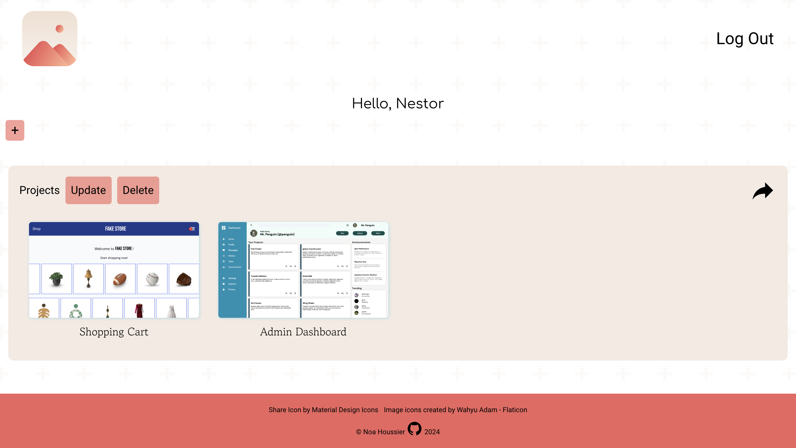

<a id="top"></a>

<div align="center">
    <a href="https://github.com/NestorNebula/file-uploader">
        
    </a>
    
<h3>File Uploader</h3>
</div>

## About



File Uploader is an app where users can create folders and store image files inside of them.

Users can generate a link to share their folders to anyone for a certain amount of time.

Each file can be downloaded either by the user that uploaded it or by anyone who received a share link.

The user can also delete his own folders/files.

### Built With

[](https://nodejs.org/)
[](https://expressjs.com/)
[](https://www.postgresql.org/)
[](https://www.prisma.io/)

#### AND


[](https://www.passportjs.org/)
[](https://cloudinary.com/)


## Getting Started

### Prerequisites

- NPM
- NodeJS
- PostgreSQL
- Cloudinary Account (get started with [this guide](https://cloudinary.com/documentation/how_to_integrate_cloudinary))

### Installation

1. Fork the repository
2. Clone the forked repository to your local machine
   ```
   git clone git@github.com:<your username>/<repo name>.git
   ```
3. Update remote URL

   ```
   # SSH:
   git remote add upstream git@github.com:file-uploader/<repo name>.git

   # HTTPS:
   git remote add upstream https://github.com/file-uploader/<repo name>.git
   ```

4. Create a postgreSQL database
5. Create a .env file in the project root directory with the following keys

   ```
   PORT=8080
   DATABASE_URL="postgresql://<role_name>:<role_password>@localhost:5432/<your_db_name>"
   SESSION_SECRET=<secret>

   # These keys should be your cloudinary keys
   CLOUD_NAME=<your_cloud_name>
   API_KEY=<your_api_key>
   API_SECRET=<your_api_secret>
   ```

6. Install required packages
   ```
   npm install
   ```
7. Run the following command in your terminal.
   ```
   npx prisma migrate dev --name localdb_migration
   ```
8. Open the app
   ```
   node --watch app.js
   ```

If an error occurs, make sure you have done everything properly according to this guide. If you think so, you can <a href="https://github.com/NestorNebula/file-uploader/issues">Open an Issue</a>.

## Usage

Create an account and log in.

You can now create folders and upload files inside of them. You can also download the files and create a share link to share the folders.

Any person that will access the folder's share link will be able to download the files inside of it.

## Contributing

If you find an issue within the app or want to contribute, you can <a href="https://github.com/NestorNebula/file-uploader/issues">Open an Issue</a>.

## License

[](https://github.com/NestorNebula/file-uploader/blob/main/LICENSE)

## Contact

Noa Houssier - [Github](https://github.com/NestorNebula)

<p align='right'>(<a href='#top'>go back to the top</a>)</p>
